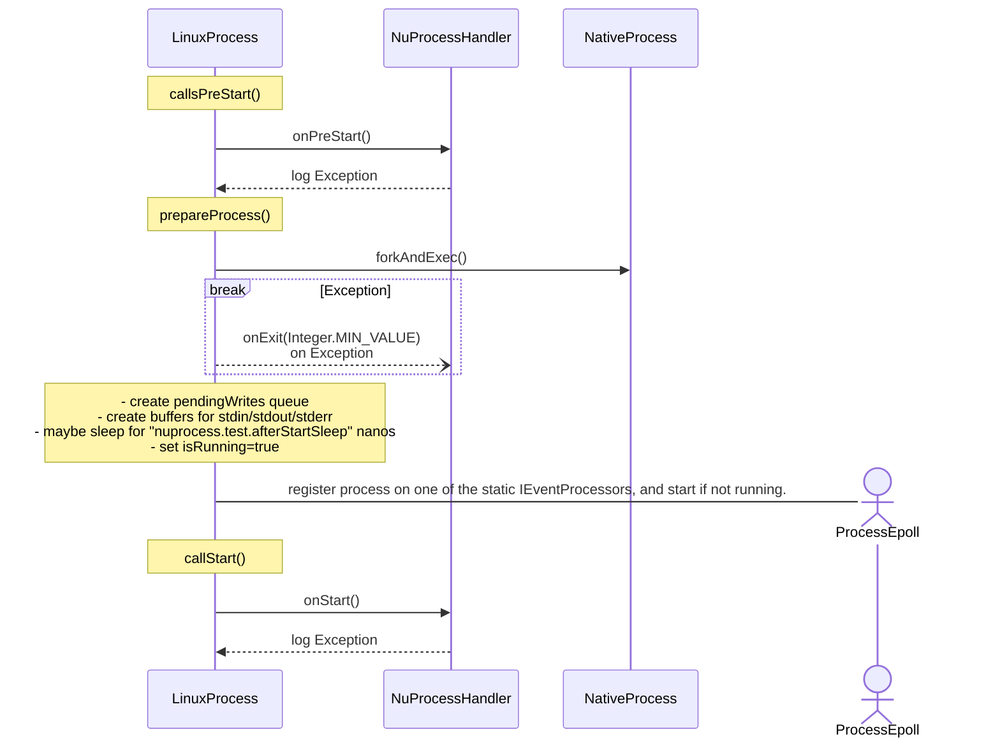
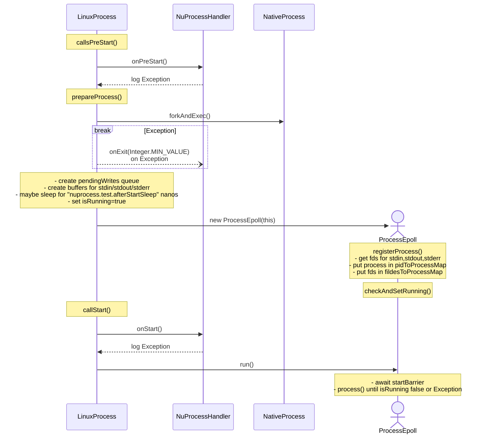
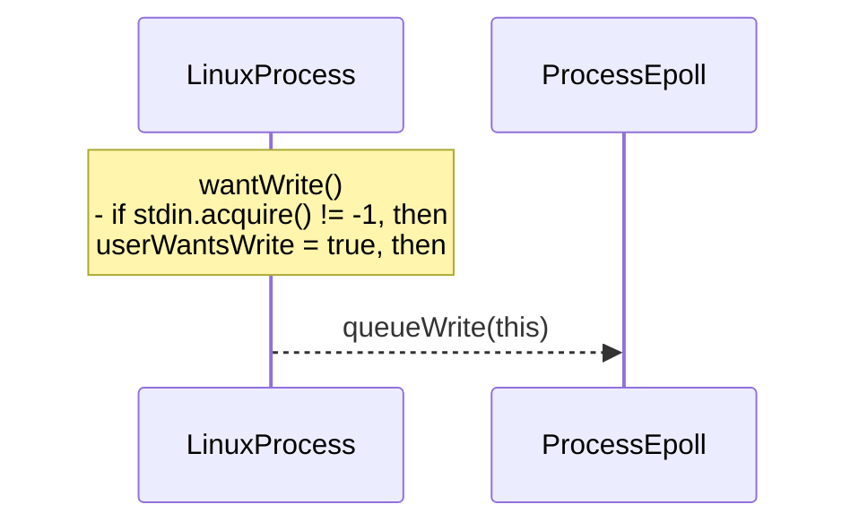
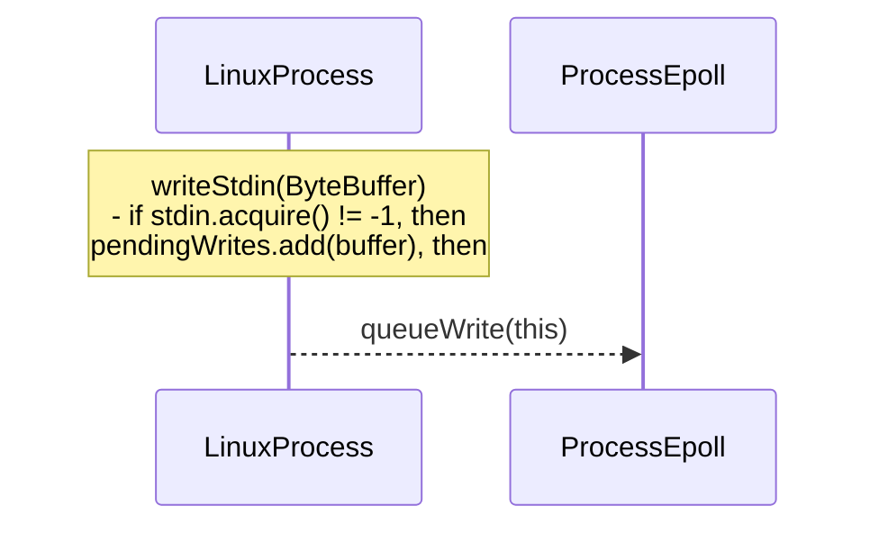
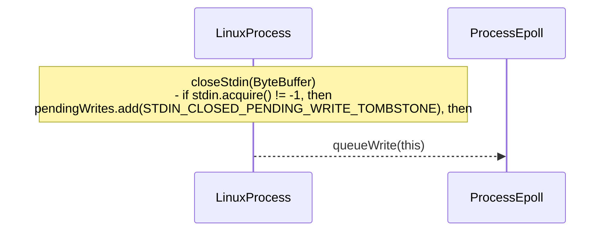
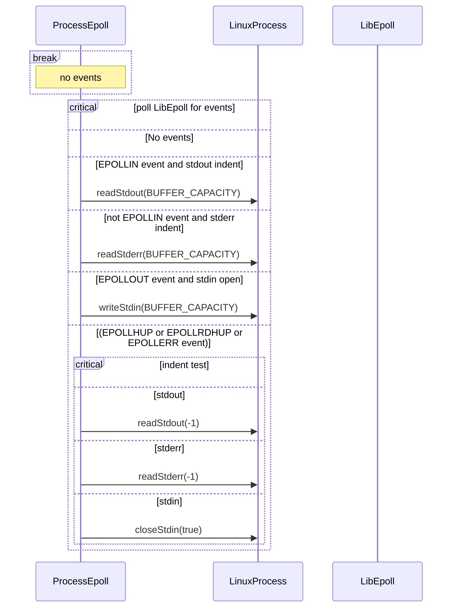

# NuProcess

[GitHub](https://github.com/brettwooldridge/NuProcess)

A low-overhead, non-blocking I/O, external Process execution implementation for Java. It is a replacement for java.lang.ProcessBuilder and java.lang.Process.
- Java 7+

----

`LinuxProcess start()`

----

`LinuxProcess run()`

----

`BasePosixProcess stdin wantWrite` Tells process to wait for stdin

----

`BasePosixProcess writeStdin` Queues up data to send to process.

----

`BasePosixProcess closeStdin` Tells process to no more stdin

----

`ProcessEpoll process()`

----

